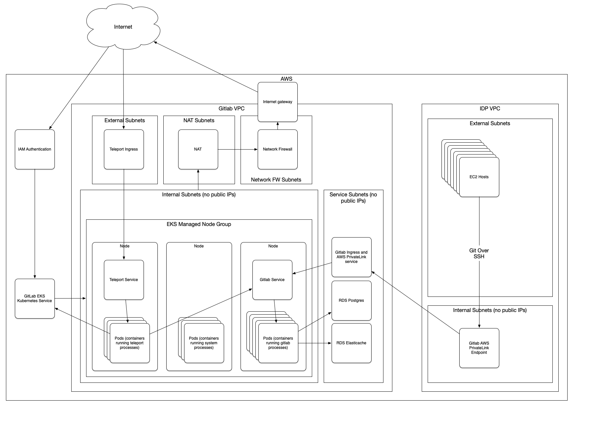

# Architecture

The FedRAMP people are unable to certifiy that [GitHub](https://github.com/)
is a suitable platform for us to manage our systems, given that we use
GitOps to manage many aspects of our systems.  
Thus, we are building our own [Gitlab](https://about.gitlab.com/)
cluster out for us to host our code.

This system is set up to run Gitlab inside of EKS.  EKS was chosen because:
* It is a system that has been deemed FedRAMP Moderate.
* It is a system that is managed by AWS, and not us.  We just specify how
  big the cluster is and what we want running in it.
* Kubernetes is a platform that has a tremendous amount of industry momentum behind it,
  which brings benefits of well-supported open source software for it, as well as
  many people who are familiar with how it works, and thus new people can hit the
  ground running when hired by login.gov.

## Philosophy

The system was built with these philosophical things in mind:
* Things should be as simple as possible, but no simpler.
* AWS resources should be managed by [Terraform](https://www.terraform.io/docs/), 
  and Kubernetes resources should be managed by [FluxCD](https://fluxcd.io/)
  as much as possible.  This lets us use tools that play to their strengths.

## System Diagram

EKS is set up to run one managed node group which hosts all the workloads.
It uses SPOT instances by default, but you can make then be on demand too.
These instances are spread across (again, by default) 2 subnets in different AZs.
These nodes can talk to the world through a NAT gateway and Network 
Firewall and otherwise do not have public IPs.  Services in these nodes are
exposed through loadbalancers that land on the public subnets and can talk
to the private node group subnets.  There is also a "services" subnet that is
also not publicly accessible that hosts various AWS services that the cluster
needs to operate, like RDS databases or Elasticache or AWS VPC endpoints.

## Components

### Gitlab

### Teleport

### aws-load-balancer-controller

### aws-node-termination-handler

### cluster-autoscaler

### dashboard

### FluxCD

### metrics-server

### Logging (fluent-bit)
