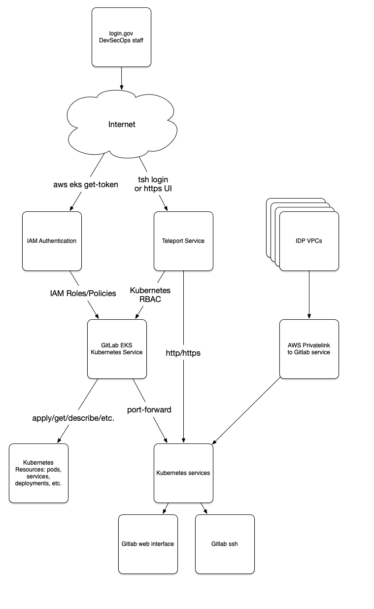

# Security

This system has been written from the ground up to be as secure as possible,
utilizing good authentication, cryptography, least privilege,
and other techniques to ensure that the data it contains is viewed and altered
only by authorized individuals, and that there are good audit logs for
every action.

## Authentication

*XXX* Need to get authentication done.  Right now, IAM is good with
all of our existing IAM roles and users, but teleport and gitlab just have
manual users set up.

## Good Cryptography

We use certificates signed by [AWS](https://aws.amazon.com/certificate-manager/)
and [LetsEncrypt](https://letsencrypt.org/) for all web services in the cluster.

https://gitlab.com/gitlab-org/gitlab/-/issues/296017

Teleport is capable of turning FIPS-mode with an Enterprise license:
https://goteleport.com/teleport/how-it-works/fedramp-ssh-kubernetes/

## Least Privilege

All actions taken by the system and by the users are constrained by 
[IAM roles](https://docs.aws.amazon.com/IAM/latest/UserGuide/id_roles.html) and
[Policies](https://docs.aws.amazon.com/IAM/latest/UserGuide/access_policies.html)
or Kuberenetes [Role Based Access Controls](https://kubernetes.io/docs/reference/access-authn-authz/rbac/).
The services running inside EKS also have a [Network Firewall](https://aws.amazon.com/network-firewall/)
to constrain what they may access.  These access control systems have been configured
to allow the minimum access required to do what the entities constrained by them
need to do.

Externally, all nodes and services are using non-public subnets and IP addesses, so cannot be
attacked from the outside.  Where services are required to be exposed to the world or
to our other clusters, we create AWS loadbalancers for those services and ensure that they have
strong authentication and logging on them.  We also can privately expose services to our
other systems with [AWS VPC PrivateLink](https://aws.amazon.com/privatelink/).  Thus,
external access is also the least amount required to do the job.

## Access

Services in the cluster can be accessed only in 3 ways:
* By using your AWS IAM Credentials to assume an IAM Role that allows you to access the EKS API.
  This is used by administrators to bootstrap the system.
* By using your Teleport credentials to access the EKS API or authorized web based applications.
  This is what users/admins will be using once the system is up.  Of note,
  the EKS API can allow you to do kubernetes port-forwarding to get access to
  non-http services such as [git over ssh](https://docs.gitlab.com/ee/ssh/).
  Also, these actions are all constrained by kubernetes RBAC, which limits
  who can access what services.
* By using a service that is exposed to other authorized VPCs over AWS PrivateLink, such as
  [git over ssh](https://docs.gitlab.com/ee/ssh/).

Teleport is the main way in for everybody.  Only a few admins will have IAM access.  Teleport
has documented many of it's FedRAMP controls that it fulfills for us here:
https://goteleport.com/teleport/how-it-works/fedramp-ssh-kubernetes/

## Logging

All services within the cluster log to stdout, and these logs are collected and sent to
[AWS CloudWatch](https://aws.amazon.com/cloudwatch/).  In addition, the cluster API logs
and the NetworkFirewall flow and alert logs are also sent there.

These logs are retained by AWS for XXX.
